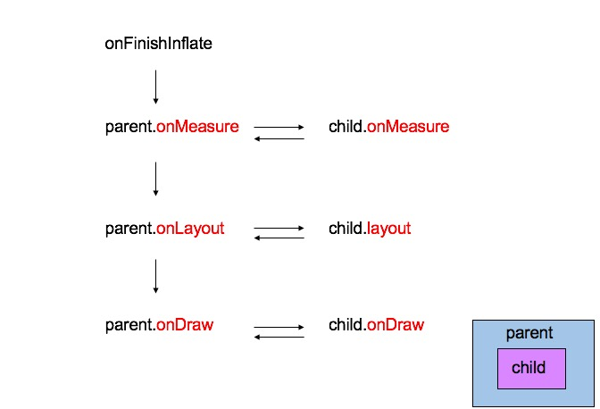
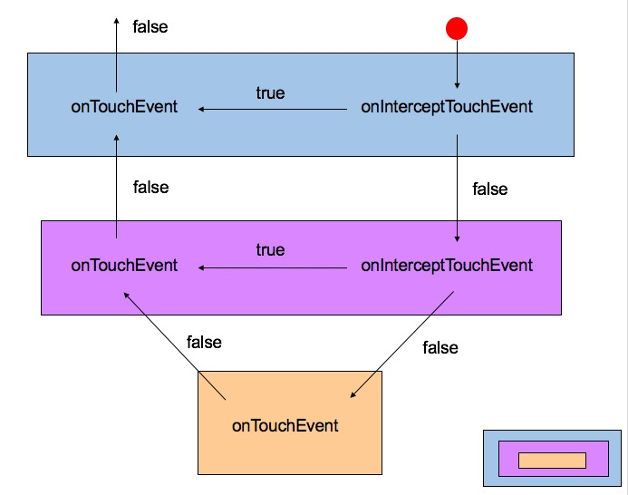

title: 深入剖析自定义View
date: 2016-06-13 14:57:34
tags: 自定义View
---

通常APP开发会使用到Button、TextView、LinearLayout等Android自身具备的组件，在某些特殊情况我们可能需要特殊改造View甚至产生新的View，一般对自定义分为三种情况：

  1. APP中大量使用某种界面，此界面只需要多种系统自带View组合即可，形成个人所需的组合View，因此产生一个新的layout文件和对应处理class即可重复使用，我们称之为自定义组合View

  2. 在某些特殊需求下，Android原有的组件能够符合90%的功能，但是某个功能无法适配，则只需要重新继承原View然后重写对应需要修改的方法即可，如使EditView支持表情图片填充，即可对绘制部分进行重写，使用span操作。

  3. 所有系统组件已无法实现需求中功能，则此时需要重新定义一个View，因此需要重头到尾全新定义View测量，布局，绘制，事件，多点触控等

<!--more-->

#### 具体步骤

此部分我们仅对上面情况中第三种进行剖析，当需要完全自定义View时，需要根据View具体情况做一下步骤：

**测量(onMeasure)**

每个View在显示在屏幕上之前，首先得知道自身的宽高，而View的宽高依赖于父控件给予的宽高空间、父控件的padding、自身控件margin等因素，任何一个变化都会影响View的区域。

测量View宽高对应自定义View的是onMeasure方法，此方法在测量时会被反复调用多次，同时当其他View变化时也会导致自身onMeasure被调用，用于调整自身区域。

通过测算和逻辑运算将自身和子控件的宽高计算完之后，通过setMeasuredDimension方法进行设置自身区域和调用子空间的measure方法，此时测量工作就结束。

**布局(onLayout)**

有了onMeasure方法对View的测量值，接下来就需要对View布局，那么布局肯定就意味着需要l,r,t,b的值才能定位一个View在屏幕中的位置，View的布局是基于父控件坐标系，也就是说自身View的坐标系是在父控件基础上，不管父控件如何移动自身View相对于父控件的坐标偏移量用于不变。

布局View是通过View中onLayout方法，同样父控件的位置对布局也会有影响，因此此方法也会被调用多次当屏幕中有组件变化时，通过逻辑运算之后得到View的具体位置，然后使用View的layout方法设置子空间位置，而自身位置由父控件决定。

**绘制(onLayout)**

通常```测量```和```布局```就可以产生一个自定义View，某些特殊情况会使用绘制，如画板。

绘制方法为onDraw，通过canvas、Paint等工具自定义View的画面，当然同样可能会使用到测量和布局中的一些值，使用canvas中各种drawXXX方法，详细后续会讲到。

onMeasure、onLayout、onDraw它们调用顺序如图：



**属性和主题(Style)**

当自定义View完成之后，不光个人使用还希望View能够分享到其他使用，因此需要将View中某些变量进行公开化以及提供一些便利的属性用于XML编写。做成一个类似系统View一样便捷，这才有开源的精神，不仅使用别人造的轮子，自身也要会造轮子。IT有句话说“不要重复造轮子，高级程序员会的只是copy”,但是造轮子的太少了。

使用style定义View的属性，同时代码中采用Attribute读取xml中的值，以及提供一些公开方法方便代码直接控制View的一些参数，具体Style如何定义和代码如何获取请详细阅读[深入剖析自定义View之Style](/2016/06/13/深入剖析自定义View之Style)。

**事件(Event)**

自定义View不仅需要展示，还需要进行有效控制View，如点击事件，滑动事件等不同情况下View做出不同的效果。

那么就需要对View的事件监听，View中onEvent也就是事件处理，通常处理Event有dispatchTouchEvent、onInterceptTouchEvent、onTouchEvent方法，每个方法有具体用途，根据event的x，y值来逻辑运算同时改变View的x，y以达到需求目的。

事件调用顺序如图所示，具体每个含义则会在[深入剖析自定义View之onEvent](/2016/06/13/深入剖析自定义View之onEvent) 详细讲述。

---
其他：   
[深入剖析自定义View之onMeasure](/2016/06/13/深入剖析自定义View之onMeasure)
[深入剖析自定义View之onLayout](/2016/06/13/深入剖析自定义View之onLayout)  
[深入剖析自定义View之onDraw](/2016/06/13/深入剖析自定义View之onDraw)
[深入剖析自定义View之Style](/2016/06/13/深入剖析自定义View之Style)  
[深入剖析自定义View之onEvent](/2016/06/13/深入剖析自定义View之onEvent)  
