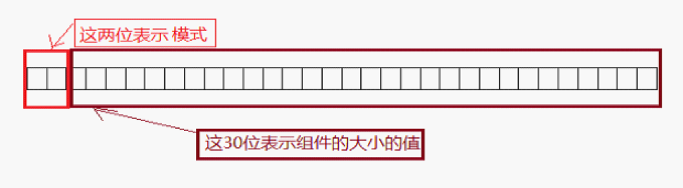

title: 深入剖析自定义View之onMeasure
date: 2016-06-13 14:57:34
tags: 自定义View
---
自定义View中我们看到很多都重写了onMeasure方法，那么我们首先得知道onMeasure是做什么的。onMeasure中文意思就是测量，所以它是用于测量View的大小，影响View大小的因素很多（父View的大小、padding、自身margin、weight），View中有一个measure方法，它会对所有View调用onMeasure方法用于测量所有View的width和height。

<!--more-->
#### 2. 代码分析
解决自定义View中onMeasure的部分代码：

``` android
@Override  
protected void onMeasure(int widthMeasureSpec, int heightMeasureSpec) {  
   int widthMode = MeasureSpec.getMode(widthMeasureSpec);  
   int heightMode = MeasureSpec.getMode(heightMeasureSpec);  
   int widthSize = MeasureSpec.getSize(widthMeasureSpec);  
   int heightSize = MeasureSpec.getSize(heightMeasureSpec);  

   int width;  
   int height;  
   ...   

   if (widthMode == MeasureSpec.EXACTLY) {  
       // Parent has told us how big to be. So be it.  
       width = widthSize;  
   } else {  
       if (mLayout != null && mEllipsize == null) {  
           des = desired(mLayout);  
       }  

   ...  
   setMeasuredDimension(width, height);   
```
从系统View中onMeasure方法可以看到其中出现了MeasureSpec类、widthMeasureSpec和heightMeasureSpec变量，这些变量又是从什么地方产生的以及有什么用途，首先我们知道onMeasure是ViewGroup的onMeasure调用的，因此参数必定是父ViewGroup传入的，待稍后我们通过系统代码展示父ViewGroup如何产生的这个参数。

#### 3. MeasureSpec

widthMeasureSpec和heightMeasureSpec变量是用于描述View宽和高的模式与尺寸，对于measureSpec来说其实隐含两个信息size和mode，measureSpec是一个int类型值共32位，其中高2位用于存储mode，低30位用于存储size，我们可以通过MeasureSpec.getMode和MeasureSpec.getSize方法进行分离，用于逻辑判断View具体需要的size。

  

我们知道在ViewGroup中，给View分配的空间大小并不是确定的，有可能随着具体的变化而变化，而这个变化的条件就是传到specMode中决定，specMode一共有三种情况：
``` text
  MeasureSpec.EXACTLY  
    父视图希望子视图的大小应该是父控件指定的specSize值。
  MeasureSpec.AT_MOST  
    子视图的大小最多是specSize中指定的值，也就是说不建议子视图的大小超过specSize中给定的值。
  MeasureSpec.UNSPECIFIED  
    我们可以随意指定视图的大小。
```

 通过以上这些分析，可以知道视图最终的大小由父视图，子视图以及程序员根据需要决定，良好的设计一般会根据子视图的measureSpec设置合适的布局大小。

此时有一个疑问我们XML中设置的width和height如何对应到onMeasure中的这两个参数的呢？我们用源码来进行讲解：
``` android
//ViewGroup中的获取,用不传递给ChildView
childWidthMeasureSpec = getRootMeasureSpec(desiredWindowWidth, lp.width);  
childHeightMeasureSpec = getRootMeasureSpec(desiredWindowHeight, lp.height);

private static int getRootMeasureSpec(int windowSize, int rootDimension) {  
    int measureSpec;  
    switch (rootDimension) {  

    case ViewGroup.LayoutParams.MATCH_PARENT:  
        // Window can't resize. Force root view to be windowSize.  
        measureSpec = MeasureSpec.makeMeasureSpec(windowSize, MeasureSpec.EXACTLY);  
        break;  
    case ViewGroup.LayoutParams.WRAP_CONTENT:  
        // Window can resize. Set max size for root view.  
        measureSpec = MeasureSpec.makeMeasureSpec(windowSize, MeasureSpec.AT_MOST);  
        break;  
    default:  
        // Window wants to be an exact size. Force root view to be that size.  
        measureSpec = MeasureSpec.makeMeasureSpec(rootDimension, MeasureSpec.EXACTLY);  
        break;  
    }  
    return measureSpec;  
}  
```
从代码中可以看出，MATCH_PARENT对应于EXACTLY，WRAP_CONTENT对应于AT_MOST，其他情况也对应于EXACTLY，它和MATCH_PARENT的区别在于size值不一样。

根据以上提到的方法我们能够获得父ViewGroup允许的高度和宽度以及模式，再根据本身View的逻辑进行计算应有的宽度和模式，然后通过```setMeasuredDimension```方法将自身高度和宽度进行设置，则View的测量就完成。
#### 4. 自定义常用
在我们自定义View测量时可能还会用到其他一些方法如：
  * ```View.resolveSize(int size,int measureSpec)``` 用于计算自身期望值和父视图提供值在模式下应该拥有的值，这个值可能等于自身期望值也可能低于期望值，因为父控件值影响
  * ```MeasureSpec.makeMeasureSpec(int size, int mode)``` 用于当我们自定义ViewGroup的时候使用mode和size获得spec
  * ```view.getMeasuredWidth``` 用于获取View的宽度测量值
  * ```view.getMeasuredHeigth```用于获取View的高度测量值
  * ```getChildMeasureSpec``` 用于获取子空间的Measurespec值

其他   
[深入剖析自定义View之onLayout](/2016/06/13/深入剖析自定义View之onLayout)  
[深入剖析自定义View之onDraw](/2016/06/13/深入剖析自定义View之onDraw)
[深入剖析自定义View之Style](/2016/06/13/深入剖析自定义View之Style)  
[深入剖析自定义View之onEvent](/2016/06/13/深入剖析自定义View之onEvent)  
